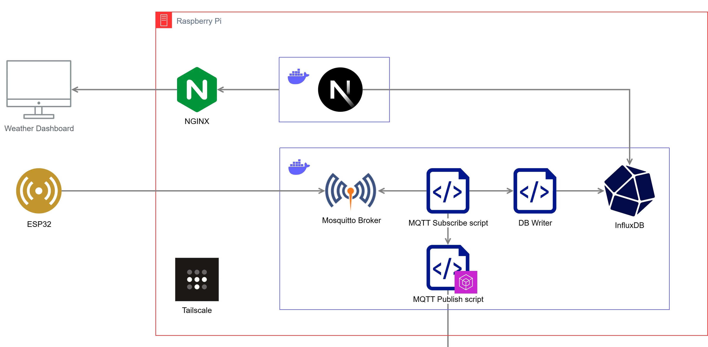
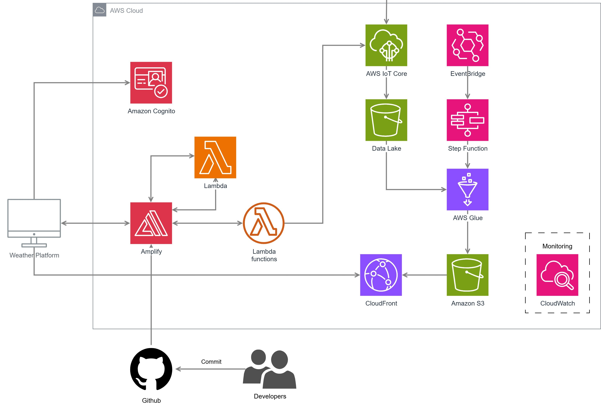
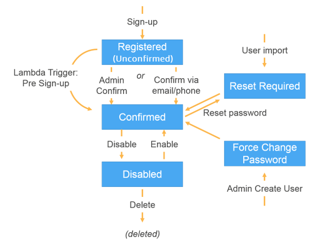

# Weather Platform Documentation (v1.0)

## Table of Contents

[Basics Knowledge](#basics-knowledge)

- [What is IoT (Internet of Things)?](#what-is-iot-internet-of-things)
- [Functional blocks of IoT Solution](#functional-blocks-of-iot-solution)
- [What we focus on](#what-we-focus-on)
- [Core functional components](#core-functional-components)

[About The Weather Platform](#about-the-weather-platform)

- [Project Overview](#project-overview)
- [Compatibility Requirements](#compatibility-requirements)
- [Edge Architecture](#edge-architecture)
- [Cloud Architecture](#cloud-architecture)
- [What is Amplify Auth?](#what-is-amplify-auth)
---

# Basic Knowledge

## What is IoT (Internet of Things)?

The Internet of Things (IoT) refers to the network of interconnected physical devices embedded with sensors, software, and network connectivity that enables them to collect and exchange data. These devices can range from simple sensors measuring temperature and humidity to complex industrial equipment.

## Functional Blocks of IoT Solutions

**Devices and Sensors** are physical components that measure environmental parameters such as temperature, humidity, pressure, or motion. They convert these measurements into digital data that can be transmitted over networks.

**Communication Gateway** serves as the bridge between devices and the cloud platform. It accepts incoming messages using various communication protocols including MQTT, HTTP, CoAP, and AMQP. The gateway handles protocol translation, data aggregation, and secure transmission to cloud services.

**IoT Platform** acts as the central orchestrator of the entire IoT solution. It manages device connectivity, ingests high-volume data streams, stores information in time-series databases, and provides APIs for data access. The platform handles device authentication, message routing, and data processing at scale.

**Applications and User Interfaces** provide the end-user experience, presenting processed data through dashboards, mobile applications, or web interfaces. These applications enable users to monitor device status, visualize data trends, and configure system parameters.

## Project Focus

**Primary Use Case:** This Weather Platform was specifically developed for **Itea Lab's weather station management**, providing centralized monitoring and device management for lab-deployed weather station kits. The platform eliminates the need for manual data collection and individual device monitoring.

**IoT Architecture Focus:** Based on the functional blocks of IoT solutions discussed earlier, this project specifically implements the **IoT Platform** component, but designed for small-scale deployments. While enterprise IoT platforms handle thousands of devices and massive data streams, our implementation focuses on:

- **Small-scale device management** (typically 5-50 weather stations)
- **Simplified data processing** optimized for weather telemetry
- **Cost-effective AWS services** suitable for laboratory and research environments
- **Educational demonstration** of cloud-native IoT architecture patterns

**Target Audience:**

- Laboratory personnel managing weather station deployments
- Researchers requiring centralized weather data collection
- Anyone with compatible weather station hardware following the specified message format

**Current Scope:** The platform demonstrates cloud-native IoT architecture using AWS managed services, specifically optimized for weather telemetry data processing and visualization.

### Core Functional Components

**Edge Interface and Message Broker** handles communication with multiple IoT devices using wireless technologies such as Wi-Fi, Bluetooth, LoRaWAN, and cellular connections. This component aggregates data from various sources and routes messages through a unified message bus architecture.

**Message Router and Communication Management** processes incoming messages by adding contextual information, performing data transformations, and applying business logic rules. It handles format conversions between different data types and eliminates duplicate messages to ensure data quality.

**Time-Series Data Storage** manages the persistent storage of sensor data in chronological order. This component is optimized for high-frequency data ingestion and provides efficient querying capabilities for historical data analysis.

**Rules Engine** monitors incoming data streams and system events to trigger automated actions based on predefined conditions. This component enables real-time alerting, data validation, and automated device control responses.

### Project Implementation Approach

This Weather Platform leverages AWS managed services to implement IoT functionality without building infrastructure from scratch. The platform uses a serverless architecture that provides scalability, reliability, and cost-effectiveness.

**Key Implementation Strategy:**

- AWS IoT Core for device connectivity and message routing (MQTTS protocol only)
- AWS Lambda functions for serverless business logic processing
- Amazon Cognito for user authentication and authorization
- AWS Amplify Gen 2 for backend infrastructure management
- Next.js with App Router for the web application frontend
- Real-time data visualization using WebSocket connections
- S3 and CloudFront for data storage and content delivery
- AWS Glue for ETL processing to transform individual telemetry messages into consolidated datasets

**Current Platform Capabilities:**

- User registration and secure authentication
- IoT device registration and management
- Real-time weather telemetry data collection and visualization
- Basic historical data storage and retrieval
- Device status monitoring and connectivity tracking
- Multi-tenant architecture supporting multiple users
- Weather-specific UI components and dashboards

**Current Limitations:**

- **Message Format Restriction**: Only supports weather telemetry messages in the predefined format
- **Protocol Limitation**: MQTTS (MQTT over TLS) only - no HTTP, CoAP, or other protocols
- **UI Specialization**: User interface is specifically designed for weather data - not generic IoT data
- **Analytics Gap**: Advanced analytics and machine learning features not yet implemented
- **Device Type Restriction**: Built for weather station kits - other device types may require modifications

# About The Weather Platform

## Project Overview

The Weather Platform is a **specialized IoT solution** designed for **ITea Lab's weather station fleet management**. The primary goal is to **centralize device management** and eliminate the need for manual data collection from individual weather station kits deployed across different locations.

**Problem Statement:**
Previously, lab personnel had to manually visit each weather station to collect data and check device status, which was time-consuming and inefficient for managing multiple remote installations.

**Solution:**
A cloud-based platform that automatically collects, processes, and visualizes weather data from multiple stations, providing real-time monitoring and centralized device management capabilities.

## Compatibility Requirements

**Supported Weather Stations:**

- **Primary Target**: ITea Lab weather station kits
- **Compatible Devices**: Any weather station following the specified message format structure
- **Protocol Requirements**: Must support MQTTS (MQTT over TLS) communication
- **Message Format**: Must conform to the predefined weather telemetry JSON schema

**Message Format Example:**

```json
{
  "deviceId": "weather-station-001",
  "timestamp": "2025-01-15T10:30:00Z",
  "temperature": 22.5,
  "humidity": 65.2,
  "pressure": 1013.25,
  "windSpeed": 5.8,
  "windDirection": 180,
  "rainfall": 0.0
}
```

**Device Requirements:**

- Wi-Fi connectivity for MQTTS communication
- X.509 certificate support for AWS IoT Core authentication
- JSON message formatting capability
- Ability to publish to AWS IoT Core topics

The system consists of edge devices for data collection and a cloud-based platform for data processing, storage, and visualization.

## System Architecture

### Edge Architecture

The edge components use MQTT (Message Queuing Telemetry Transport) protocol for device communication. MQTT is a lightweight, publish-subscribe messaging protocol designed for IoT applications with limited bandwidth and intermittent connectivity.

**Edge Components:**

- Weather sensor devices with Wi-Fi connectivity
- Local data collection and buffering capabilities
- MQTT client implementation for cloud communication
- Device authentication using X.509 certificates



### Cloud Architecture

The cloud infrastructure is built on AWS services using a serverless architecture pattern:

**Core Services:**

- AWS IoT Core for device connectivity and message routing
- AWS Lambda functions for data processing and business logic
- Amazon Cognito for user authentication and access control
- Amazon S3 for data storage and static file hosting
- AWS Glue for data cataloging and ETL operations
- Amazon CloudFront for content delivery and caching
- AWS Amplify for application deployment and hosting



#### What is Amplify Gen 2 ?
AWS Amplify Gen 2 is the latest generation of AWS Amplify, a development platform for building secure, scalable mobile and web applications. Amplify Gen 2 introduces several enhancements over the previous version, including:
- Improved integration with AWS Cloud Development Kit (CDK) for defining backend infrastructure as code
- Enhanced developer experience with simplified CLI commands and workflows
- Better support for modern frontend frameworks and architectures
- Enhanced support for server-side rendering (SSR) and static site generation (SSG) with frameworks like Next.js 
- Sandbox environments for isolated development and testing

#### What is Amplify Auth?

Amplify Auth is AWS Amplify's authentication service that provides secure user management and access control for web and mobile applications. It is built on Amazon Cognito and integrates two core services:

**Amazon Cognito User Pools** manage user registration, authentication, and profile management. User Pools provide features such as user sign-up/sign-in, password policies, multi-factor authentication, and user attribute management.

**Amazon Cognito Identity Pools** provide temporary AWS credentials to authenticated users, enabling secure access to AWS services. Identity Pools support both authenticated and unauthenticated access patterns.

#### What is Amplify Functions?

Amplify Functions is AWS Amplify's abstraction layer for creating and managing serverless functions powered by AWS Lambda. It simplifies the process of developing, testing, and deploying cloud functions within Amplify Gen 2 applications.

In this Weather Platform, Amplify Functions handle core business logic including:

- Device registration and management via AWS IoT Core
- Weather data processing and retrieval
- Authentication validation and authorization
- API endpoint implementation for frontend services

Functions are defined in the `amplify/functions/` directory with resource definitions (`resource.ts`) and handler implementations (`handler.ts`). They're automatically deployed when running `ampx sandbox` or production deployment commands.


### Setup Next.js Application

The Weather Platform uses Next.js 15 with the App Router architecture for the frontend application. The application includes:

**Project Structure:**

```
src/
├── app/                   # Next.js App Router pages
│   ├── (platform)/        # Protected platform routes
│   └── api/               # API route handlers
├── components/            # React components
├── hooks/                 # Custom React hooks
├── lib/                   # Utility libraries
└── types/                 # TypeScript type definitions
```

### Setup Amplify Backend (Manual Installation)

**Prerequisites:**

- Node.js 18 or later
- AWS CLI configured with appropriate permissions
- AWS account with `AmplifyBackendDeployFullAccess` and `AWSIoTFullAccess` policies

**Important Note:** This platform uses **AWS Amplify Gen 2**, which provides improved developer experience and enhanced CDK integration compared to Amplify Gen 1.

#### Cloud Sandbox Environment

AWS Amplify Sandbox environments provide isolated development instances that mirror production infrastructure. These environments enable rapid development and testing without affecting production systems.

**Sandbox Benefits:**

- Automatic deployment on code changes
- Isolated resources per developer
- Full feature parity with production
- Cost-effective development environment
- Easy cleanup and recreation

**Lambda Functions Implementation**

The Weather Platform implements six Lambda functions for core functionality:

1. **addThing** - Registers new IoT devices in AWS IoT Core
2. **deleteThing** - Removes IoT devices and associated resources
3. **fetchThings** - Retrieves list of registered devices
4. **getIoTEndpoint** - Provides IoT Core endpoint configuration
5. **getDataset** - Accesses historical weather data from S3
6. **getTotalReadings** - Calculates aggregated sensor statistics

**API Routes Integration:**
Each Lambda function is accessible through Next.js API routes using Amplify server context for authentication:

- `/api/iot/register` - Device registration
- `/api/iot/deleteThing` - Device removal
- `/api/iot/fetchThings` - Device listing
- `/api/iot/endpoint` - IoT endpoint discovery
- `/api/weather/dataset` - Weather data access
- `/api/weather/totalReadings` - Data analytics

#### Amplify Installation and Setup

**Package Installation:**
Install required Amplify Gen 2 packages for the project:

```bash
pnpm add -D @aws-amplify/backend @aws-amplify/backend-cli typescript aws-cdk-lib constructs @aws-amplify/adapter-nextjs
```

**CLI Tool Distinction:**

- `ampx` CLI = Amplify Generation 2 (current, recommended)
- `amplify` CLI = Amplify Generation 1 (legacy, deprecated)

**pnpm on Windows Limitation:**
The `create-amplify` scaffolding tool does not support pnpm on Windows due to symlink architecture conflicts. However, `npx ampx` commands work properly for deployment and management. This project uses manual setup to bypass this limitation while maintaining pnpm for dependency management.

**Global CLI Installation:**

```bash
# Install Amplify Gen 2 CLI
npm install -g @aws-amplify/backend-cli
```

#### Amplify Backend Configuration

**Directory Structure Setup:**
Create the Amplify backend directory structure:

```bash
mkdir amplify
mkdir amplify/auth
mkdir amplify/functions
mkdir amplify/custom
```

**Main Backend Configuration (`amplify/backend.ts`):**

```typescript
import { defineBackend } from "@aws-amplify/backend";
import { auth } from "./auth/resource";
import { addThing } from "./functions/addThing/resource";
import { fetchThings } from "./functions/fetchThings/resource";
import { deleteThing } from "./functions/deleteThing/resource";
import { getIoTEndpoint } from "./functions/getIoTEndpoint/resource";
import { getDataset } from "./functions/getDataset/resource";
import { getTotalReadings } from "./functions/getTotalReadings/resource";

export const backend = defineBackend({
  auth,
  addThing,
  fetchThings,
  deleteThing,
  getIoTEndpoint,
  getDataset,
  getTotalReadings,
});
```

**Authentication Configuration (`amplify/auth/resource.ts`):**

```typescript
import { defineAuth } from "@aws-amplify/backend";

export const auth = defineAuth({
  loginWith: {
    email: true,
  },
  userAttributes: {
    email: {
      required: true,
    },
  },
});
```

**Project Structure:**

```
Weather-Platform/
├── amplify/
│   ├── backend.ts          # Main backend configuration
│   ├── auth/
│   │   └── resource.ts     # Authentication setup
│   ├── functions/          # Lambda functions
│   │   ├── addThing/
│   │   ├── deleteThing/
│   │   ├── fetchThings/
│   │   ├── getDataset/
│   │   ├── getIoTEndpoint/
│   │   └── getTotalReadings/
│   └── custom/             # CDK constructs
├── src/                    # Next.js application
├── package.json
└── pnpm-lock.yaml
```

#### AWS Configuration and Deployment

**AWS Profile Configuration:**
Configure AWS credentials for Amplify deployment:

```bash
# Configure AWS profile
npx ampx configure profile
```

This command prompts for AWS credentials including:

- AWS Access Key ID
- AWS Secret Access Key
- Default region (recommend us-east-1)
- Output format (json recommended)

**Credential Sources:**
AWS credentials can be obtained from:

- IAM Users with programmatic access
- AWS Organizations account access
- Temporary credentials from AWS STS

**Reference:** [AWS Account Setup Guide](https://docs.amplify.aws/nextjs/start/account-setup/)

**Removing existing profile (if needed):**

If you want to remove your current profile, follow these steps:

Step 1: Remove the existing default profile manually

You'll need to edit two files:

- Windows: `C:\Users\<your-user>\.aws\credentials`
- Windows: `C:\Users\<your-user>\.aws\config`

⚠️ Important: If you have multiple profiles, do not delete the entire file—only remove the [default] section.

Example:

```
[default]
aws_access_key_id = AKIA...
aws_secret_access_key = xxxx...

[other-profile]
aws_access_key_id = AKIA...
aws_secret_access_key = yyyy...
```

Step 2: Confirm it's removed

Run: `aws configure list-profiles`

You should no longer see default listed.

Then just run `npx ampx configure profile` again to setup new profile

**\*Follow instruction from this link:** https://docs.amplify.aws/nextjs/start/manual-installation/*

**Sandbox Deployment:**

Deploy the backend to Amplify sandbox environment:

```bash
npx ampx sandbox
```

**First-Time Bootstrap Process:**
On initial deployment, AWS CDK requires bootstrapping for the target region. The command will display:

```
The region <your-region> has not been bootstrapped. Sign in to the AWS console as a Root user or Admin to complete the bootstrap process.
```

**Bootstrap Steps:**

1. Sign in to AWS Management Console with administrative privileges
2. Navigate to the opened Amplify console tab
3. Complete the bootstrap initialization (3-5 minutes)
4. Return to terminal and re-run the sandbox command

**Sandbox Management:**

```bash
# Deploy/update sandbox
npx ampx sandbox

# Deploy once without watching for changes
npx ampx sandbox --once

# Terminate sandbox environment
npx ampx sandbox delete
```

**Important:** Sandbox resources incur AWS charges. Monitor usage through AWS Cost Explorer and terminate unused environments promptly.

**Reference:** [Amplify Sandbox Documentation](https://docs.amplify.aws/nextjs/deploy-and-host/sandbox-environments/setup/)

#### Amazon Cognito Configuration

**Automatic Deployment:**
Amazon Cognito User Pool and Identity Pool are automatically created during Amplify backend deployment. These services provide authentication and authorization for the Weather Platform.

**Frontend Integration:**
Configure the Next.js application to use Amplify authentication:

```typescript
// In your React components
import outputs from "../amplify_outputs.json";
import { Amplify } from "aws-amplify";

Amplify.configure(outputs);
```

##### User Management

**Automatic Backend Setup:**
When you deploy the Amplify backend using `npx ampx sandbox`, the following resources are automatically created and configured:

- **Cognito User Pool**: For user authentication and management
- **Cognito Identity Pool**: For providing AWS service access to authenticated users
- **Default User Group**: `platform-admin` group with appropriate IAM role and permissions
- **IAM Roles**: Automatically configured with necessary permissions for IoT Core and platform access

**Manual Steps Required (Post-Deployment):**

**User Creation Process:**

1. Navigate to **Amazon Cognito** service in AWS Console
2. Select **User Pools** to view the automatically created pool
3. Go to **Users** section and click **"Create User"**
4. Provide user email address and set temporary password
5. Configure user attributes as needed

**Assign User to Group:**

1. In the same User Pool, go to **Groups** section
2. Select the pre-created **`platform-admin`** group
3. Click **"Add user to group"**
4. Select the newly created user and confirm assignment

**Important:** All IAM roles, permissions, and group configurations are handled automatically by the Amplify backend. You only need to create users and assign them to the existing `platform-admin` group.

##### Complete setup new user

According to Amazon Cognito [developer guide](https://docs.aws.amazon.com/cognito/latest/developerguide/signing-up-users-in-your-app.html), a user account has 4 confirmation states: Registered (Unconfirmed), Confirmed, Password Reset Required, Force Change Password, Disabled. We only need to focus on Confirmed, Password Reset Required, Force Change Password, since we don't have a Sign up option. When User accounts are created by an administrator or developer, its status will be **Force Change Password,** you won't be able to login with this account, YET.

If the user tries to log in directly without doing this, you'll get this error:
**"User needs to be authenticated to call this API" (error 400 - Bad Request)**

The next step here is to let user change it to a new password, only then can it be marked as **Confirmed.** Now try to log in again




**Link to documentation:**

- https://docs.amplify.aws/nextjs/build-a-backend/auth/set-up-auth/
- https://docs.aws.amazon.com/cognito/latest/developerguide/signing-up-users-in-your-app.html
- https://docs.aws.amazon.com/cognito-user-identity-pools/latest/APIReference/API_ChangePassword.html

### Launching Lambda Functions

Before setup, make sure you have installed `@types/aws-lambda` for the current project

```bash
pnpm add -D @types/aws-lambda
```

#### Project Structure

Your Amplify project should have the following structure:

```
amplify/
├── backend.ts
├── auth/
│   └── resource.ts
└── functions/
    ├── addThing/
    │   ├── resource.ts
    │   └── handler.ts
    └── getDataset/
        ├── resource.ts
        └── handler.ts
```

#### Create Function Directories

Create the function directories inside the `amplify/functions/` folder:

```bash
mkdir -p amplify/functions/addThing
mkdir -p amplify/functions/getDataset
```

#### Define Function Resources

**addThing/resource.ts:**

```typescript
import { defineFunction } from "@aws-amplify/backend";

export const addThing = defineFunction({
  name: "add-thing",
  entry: "./handler.ts",
  environment: {
    AWS_IOT_THING_GROUP_NAME: "ITeaWeatherHub",
    AWS_IOT_POLICY_NAME: "WeatherStationPolicies",
  },
  timeoutSeconds: 30,
  memoryMB: 128,
  runtime: 20, // Node.js 20.x
});
```

**getDataset/resource.ts:**

```typescript
import { defineFunction } from "@aws-amplify/backend";

export const getDataset = defineFunction({
  name: "get-dataset",
  entry: "./handler.ts",
  environment: {
    // Environment variables are automatically provided by Amplify
  },
  timeoutSeconds: 30,
  memoryMB: 256,
  runtime: 20, // Node.js 20.x
});
```

#### Create Function Handlers

**addThing/handler.ts:**

```typescript
import type { Handler } from "aws-lambda";
import { env } from "$amplify/env/add-thing";
import {
  IoTClient,
  CreateThingCommand,
  AddThingToThingGroupCommand,
  AttachThingPrincipalCommand,
  AttachPolicyCommand,
  DescribeEndpointCommand,
} from "@aws-sdk/client-iot";
import { STSClient, GetCallerIdentityCommand } from "@aws-sdk/client-sts";

const region = process.env.AWS_REGION!;

// Initialize AWS clients
const iot = new IoTClient({ region });
const sts = new STSClient({ region });

export const handler: Handler = async (event, context) => {
  console.log("Event received:", JSON.stringify(event, null, 2));

  const thingName = event.thingName || `Thing-${Date.now()}`;
  const thingGroupName = env.AWS_IOT_THING_GROUP_NAME;
  const policyName = env.AWS_IOT_POLICY_NAME;
  const principal = event.principal; // Certificate ARN from device registration

  try {
    // Validate inputs
    if (!thingGroupName || !policyName) {
      throw new Error(
        "AWS_IOT_THING_GROUP_NAME and AWS_IOT_POLICY_NAME must be defined"
      );
    }

    if (!principal) {
      throw new Error(
        "Principal (certificate ARN) is required to attach policy"
      );
    }

    // Dynamically get AWS account ID
    const callerIdentity = await sts.send(new GetCallerIdentityCommand({}));
    const accountId = callerIdentity.Account;

    // Get IoT endpoint that devices will use to connect
    const endpointResponse = await iot.send(
      new DescribeEndpointCommand({
        endpointType: "iot:Data-ATS", // ATS endpoint for device connections
      })
    );
    const iotEndpoint = endpointResponse.endpointAddress;

    // Step 1: Create IoT Thing (represents your weather sensor)
    await iot.send(
      new CreateThingCommand({
        thingName,
        attributePayload: {
          attributes: {
            createdAt: new Date().toISOString(),
            iotEndpoint: iotEndpoint || "unknown",
            accountId: accountId || "unknown",
          },
        },
      })
    );

    // Step 2: Add Thing to Thing Group (organize devices)
    await iot.send(
      new AddThingToThingGroupCommand({
        thingName,
        thingGroupName,
      })
    );

    // Step 3: Attach Thing to Certificate (device authentication)
    await iot.send(
      new AttachThingPrincipalCommand({
        thingName,
        principal,
      })
    );

    // Step 4: Attach Policy to Certificate (device permissions)
    await iot.send(
      new AttachPolicyCommand({
        policyName,
        target: principal,
      })
    );

    // Return connection details for device configuration
    return {
      statusCode: 200,
      body: JSON.stringify({
        message: `Weather sensor ${thingName} registered successfully`,
        thingName,
        thingGroup: thingGroupName,
        policy: policyName,
        deviceConnectionInfo: {
          endpoint: iotEndpoint,
          port: 8883,
          protocol: "MQTT over TLS",
          topics: {
            publish: `weather/data/${thingName}`,
            subscribe: `weather/commands/${thingName}`,
          },
          certificateArn: principal,
        },
        accountId,
      }),
    };
  } catch (error) {
    console.error("Error registering weather sensor:", error);
    return {
      statusCode: 500,
      body: JSON.stringify({
        error: "Failed to register weather sensor",
        details: error instanceof Error ? error.message : String(error),
        thingName: thingName,
      }),
    };
  }
};
```

**getDataset/handler.ts:**

```typescript
import type { Handler } from "aws-lambda";
import { S3Client, GetObjectCommand } from "@aws-sdk/client-s3";

export const handler: Handler = async (event, context) => {
  console.log("Event received:", JSON.stringify(event, null, 2));

  try {
    // Initialize AWS clients
    const s3Client = new S3Client({ region: process.env.DEFAULT_REGION });

    // Your business logic here - interact with S3, retrieve datasets, etc.

    return {
      statusCode: 200,
      body: JSON.stringify({
        message: "Dataset retrieved successfully",
        // Add your response data
      }),
    };
  } catch (error) {
    console.error("Error:", error);
    return {
      statusCode: 500,
      body: JSON.stringify({
        error: "Internal server error",
        details: error instanceof Error ? error.message : String(error),
      }),
    };
  }
};
```

#### Update Backend Configuration

Update your `amplify/backend.ts` file to include the new functions:

```typescript
import { defineBackend } from "@aws-amplify/backend";
import { auth } from "./auth/resource";
import { addThing } from "./functions/addThing/resource";
import { getDataset } from "./functions/getDataset/resource";
import * as iam from "aws-cdk-lib/aws-iam";

export const backend = defineBackend({
  auth,
  addThing,
  getDataset,
});

// Add IoT permissions to addThing function
const addThingLambda = backend.addThing.resources.lambda;
addThingLambda.addToRolePolicy(
  new iam.PolicyStatement({
    actions: [
      "iot:CreateThing",
      "iot:AddThingToThingGroup",
      "iot:CreateKeysAndCertificate",
      "iot:AttachPolicy",
      "iot:AttachThingPrincipal",
      "iot:DescribeEndpoint",
    ],
    resources: ["*"],
  })
);
```

Now when you run `npx ampx sandbox` or deploy your app on Amplify, it will include your Functions.

**Link to documentation:**

- https://docs.amplify.aws/nextjs/build-a-backend/functions/set-up-function/
- https://github.com/aws/aws-sdk-js-v3
- https://docs.aws.amazon.com/AWSJavaScriptSDK/v3/latest/client/iot/

### Launching CDK Storage (S3)

**Note:** This section replaces the previous "Launching S3 using CDK" section with updated CDK-based approach.

This guide covers setting up S3 storage using **CDK custom constructs** instead of traditional Amplify storage to avoid circular dependencies and gain better control over bucket policies.

#### Why CDK Storage Instead of Amplify Storage?

Our Weather Platform uses **CDK Custom Constructs** for storage to:

- **Eliminate Circular Dependencies**: No conflicts between CloudFront and Amplify bucket policies
- **Better Policy Control**: Full control over IAM permissions and bucket policies
- **CloudFormation Cleanup**: Easier to delete and redeploy stacks without policy conflicts
- **Advanced Configuration**: Lifecycle rules, CORS policies, and custom tags

#### CDK Storage Implementation

Create the custom storage construct at `amplify/custom/WeatherDatasetStorage/resource.ts`:

```typescript
import { defineBackend } from "@aws-amplify/backend";
import { Bucket, HttpMethods } from "aws-cdk-lib/aws-s3";
import { RemovalPolicy, Duration } from "aws-cdk-lib";

export function createWeatherDatasetStorage(backend: any) {
  const weatherBucket = new Bucket(backend.stack, "WeatherDatasetBucket", {
    bucketName: `weather-dataset-${backend.stack.account}-${backend.stack.region}`,
    removalPolicy: RemovalPolicy.DESTROY,
    autoDeleteObjects: true,

    // Lifecycle rules for efficient storage management
    lifecycleRules: [
      {
        id: "DeleteTempDataAfter7Days",
        enabled: true,
        prefix: "temp/",
        expiration: Duration.days(7),
      },
    ],

    // CORS configuration for web access
    cors: [
      {
        allowedOrigins: ["*"],
        allowedMethods: [
          HttpMethods.GET,
          HttpMethods.PUT,
          HttpMethods.POST,
          HttpMethods.DELETE,
        ],
        allowedHeaders: ["*"],
        exposedHeaders: ["ETag"],
        maxAge: 3000,
      },
    ],

    // Resource tags
    tags: {
      Project: "WeatherPlatform",
      Environment: "Development",
      ManagedBy: "CDK",
    },
  });

  return weatherBucket;
}
```

#### Backend Integration

Update `amplify/backend.ts` to use the CDK storage:

```typescript
import { defineBackend } from "@aws-amplify/backend";
import { createWeatherDatasetStorage } from "./custom/WeatherDatasetStorage/resource";

export const backend = defineBackend({
  auth,
  // ... other resources
});

// Create CDK storage bucket
const weatherBucket = createWeatherDatasetStorage(backend);

// Export bucket information for other services
backend.addOutput({
  custom: {
    WeatherDatasetBucket: {
      bucketName: weatherBucket.bucketName,
      bucketDomainName: weatherBucket.bucketDomainName,
    },
  },
});
```

Now run the sandbox again using: `npx ampx sandbox --profile <profile_name>`

This will check for current amplify backend configuration and update CloudFormation stack to deploy an S3 bucket in your account.

**Link to documentation:** https://docs.amplify.aws/nextjs/build-a-backend/storage/set-up-storage/

### Launching AWS Glue

**Note:** This section has been updated to reflect CDK-based implementation.

#### Glue Components

Our Weather Platform uses AWS Glue for data processing with the following components:

1. **Glue Database**: Central catalog for weather telemetry schemas
2. **Glue Crawler**: Discovers and catalogs raw telemetry data schema
3. **Glue ETL Job**: Transforms raw data into structured CSV datasets

#### CDK Glue Implementation

The Glue pipeline is implemented as a CDK custom construct. Create `amplify/custom/WeatherDataGlue/resource.ts`:

```typescript
import * as glue from "aws-cdk-lib/aws-glue";
import {
  Role,
  ServicePrincipal,
  ManagedPolicy,
  PolicyDocument,
  PolicyStatement,
  Effect,
} from "aws-cdk-lib/aws-iam";

export function createWeatherGlueResources(backend: any, weatherBucket: any) {
  // Create Glue Database
  const glueDatabase = new glue.CfnDatabase(
    backend.stack,
    "WeatherGlueDatabase",
    {
      catalogId: backend.stack.account,
      databaseInput: {
        name: `weather_data_catalog_${Math.random().toString(36).substring(7)}`,
        description: "Database for weather platform telemetry data",
      },
    }
  );

  // IAM Role for Glue with specific permissions
  const glueRole = new Role(backend.stack, "WeatherGlueServiceRole", {
    assumedBy: new ServicePrincipal("glue.amazonaws.com"),
    managedPolicies: [
      ManagedPolicy.fromAwsManagedPolicyName("service-role/AWSGlueServiceRole"),
    ],
    inlinePolicies: {
      GlueS3Access: new PolicyDocument({
        statements: [
          new PolicyStatement({
            sid: "AllowGlueScriptAccess",
            effect: Effect.ALLOW,
            actions: ["s3:GetObject", "s3:ListBucket"],
            resources: [
              "arn:aws:s3:::itea-weather-data-lake-storage",
              "arn:aws:s3:::itea-weather-data-lake-storage/glue-scripts/*",
            ],
          }),
        ],
      }),
    },
  });

  // Grant access to the weather bucket
  weatherBucket.grantReadWrite(glueRole);

  // Glue ETL Job
  const glueJob = new glue.CfnJob(backend.stack, "WeatherDataTransformJob", {
    role: glueRole.roleArn,
    command: {
      name: "glueetl",
      scriptLocation:
        "s3://itea-weather-data-lake-storage/glue-scripts/weather-transform.py",
      pythonVersion: "3",
    },
    glueVersion: "4.0",
    workerType: "G.1X",
    numberOfWorkers: 2,
    maxRetries: 1,
    timeout: 60,
    defaultArguments: {
      "--job-language": "python",
      "--job-bookmark-option": "job-bookmark-enable",
      "--enable-metrics": "true",
      "--enable-continuous-cloudwatch-log": "true",
      "--TempDir": `s3://${weatherBucket.bucketName}/temp/`,
      "--source-bucket": "source-bucket-name",
      "--target-bucket": weatherBucket.bucketName,
      "--database-name": glueDatabase.ref,
    },
  });

  return { glueDatabase, glueJob, glueRole };
}
```

#### ETL Script Upload

Base on current setup you need to do one more step (this one was manual), upload the ETL script onto the data lake storage bucket at `glue-scripts/` folder, this gives Glue ETL Job read access to the script and perform dataset transformation process.

**Link to documentation:**

- https://docs.amplify.aws/nextjs/build-a-backend/add-aws-services/custom-resources/

### Launching CloudFront

**Note:** This section has been updated to use CDK custom constructs with direct S3 bucket integration.

CloudFront distribution is implemented as a CDK custom construct that integrates directly with the CDK storage bucket to eliminate circular dependencies.

#### CDK CloudFront Implementation

Create `amplify/custom/CloudFront/resource.ts`:

```typescript
import {
  Distribution,
  OriginAccessControl,
  OriginAccessControlOriginType,
  Signing,
  AllowedMethods,
  ViewerProtocolPolicy,
  CachePolicy,
} from "aws-cdk-lib/aws-cloudfront";
import { S3Origin } from "aws-cdk-lib/aws-cloudfront-origins";
import { PolicyStatement, Effect, ServicePrincipal } from "aws-cdk-lib/aws-iam";

export function createCustomCloudFront(backend: any, weatherBucket: Bucket) {
  // Create Origin Access Control
  const originAccessControl = new OriginAccessControl(backend.stack, "OAC", {
    description: "OAC for Weather Dataset Bucket",
    originAccessControlOriginType: OriginAccessControlOriginType.S3,
    signing: Signing.SIGV4_ALWAYS,
  });

  // CloudFront distribution with direct bucket reference
  const distribution = new Distribution(
    backend.stack,
    "WeatherDatasetDistribution",
    {
      defaultBehavior: {
        origin: new S3Origin(weatherBucket, {
          originAccessControl: originAccessControl,
        }),
        allowedMethods: AllowedMethods.ALLOW_GET_HEAD,
        viewerProtocolPolicy: ViewerProtocolPolicy.REDIRECT_TO_HTTPS,
        cachePolicy: CachePolicy.CACHING_OPTIMIZED,
      },
      priceClass: PriceClass.PRICE_CLASS_200, // US, Canada, Europe, Asia, Middle East, Africa
    }
  );

  // Direct bucket policy integration - no circular dependencies
  weatherBucket.addToResourcePolicy(
    new PolicyStatement({
      sid: "AllowCloudFrontAccess",
      effect: Effect.ALLOW,
      principals: [new ServicePrincipal("cloudfront.amazonaws.com")],
      actions: ["s3:GetObject"],
      resources: [weatherBucket.arnForObjects("*")],
      conditions: {
        StringEquals: {
          "AWS:SourceArn": `arn:aws:cloudfront::${backend.stack.account}:distribution/${distribution.distributionId}`,
        },
      },
    })
  );

  return distribution;
}
```

#### Backend Integration

Update `amplify/backend.ts` to include CloudFront:

```typescript
import { createCustomCloudFront } from "./custom/CloudFront/resource";

export const backend = defineBackend({
  auth,
  addThing,
  getDataset,
});

// Create CDK storage bucket first
const weatherBucket = createWeatherDatasetStorage(backend);

// Create CloudFront CDN with direct bucket reference
const cloudFrontDistribution = createCustomCloudFront(backend, weatherBucket);

// Export outputs for frontend use
backend.addOutput({
  custom: {
    weatherCdnDomainName: cloudFrontDistribution.domainName,
    weatherCdnDistributionId: cloudFrontDistribution.distributionId,
    weatherDatasetBucket: {
      bucketName: weatherBucket.bucketName,
      bucketDomainName: weatherBucket.bucketDomainName,
    },
  },
});
```

**Link to documentation:**

- https://docs.aws.amazon.com/cdk/api/v2/python/aws_cdk.aws_cloudfront/PriceClass.html
- https://aws.amazon.com/cloudfront/pricing/

### User IoT Policy Attachment

**Critical Setup Step:** AWS IoT Core policies must be attached to individual Cognito Identity IDs to enable user access to IoT resources. This manual step is required for each registered user.

**The Challenge:**
AWS IoT Core policies can be attached to individual Cognito Identity IDs (e.g., us-east-1:12345678-1234-1234-1234-123456789012) but cannot be directly attached to Cognito Identity Pool IDs. This requires manual policy attachment for each user.

**Step-by-Step Process:**

1. **Obtain User's Cognito Identity ID:**

   - Navigate to Amazon Cognito → Identity Pools
   - Select the Amplify-generated identity pool
   - Switch to Identity Browser tab
   - Copy the user's Identity ID

2. **Attach IoT Policy via AWS CLI:**

   ```bash
   aws iot attach-principal-policy \
     --policy-name WeatherPlatformPubSubPolicy \
     --principal us-east-1:<IDENTITY_ID> \
     --region us-east-1
   ```

3. **Verify Policy Attachment:**
   - Go to AWS IoT Core → Policies
   - Select WeatherPlatformPubSubPolicy
   - Check Targets tab for the user's Identity ID

**Alternative Console Method:**

- AWS IoT Core → Policies → WeatherPlatformPubSubPolicy
- Click Attach → Attach to principal
- Enter Cognito Identity ID

**Security Note:** Users cannot access IoT Core resources until this policy attachment is completed. Consider implementing automated policy attachment through Lambda triggers for production deployments.

**Note:** This is a new critical section that addresses a major security requirement.

#### Critical Step: Authenticate Users for IoT Core Access

There is one important problem with IoT Policies that requires manual intervention. AWS IoT Core policies can be attached to individual Cognito Identity IDs (e.g., `us-east-1:12345678-1234-1234-1234-123456789012`) but **not directly** to a Cognito Identity Pool ID. This means for each user created, the administrator must perform an extra step to fully allow that user to use IoT Core resources.

#### Step-by-Step Process

**Step 1: Get User's Cognito Identity ID**

1. Navigate to **Amazon Cognito** in AWS Console
2. Go to **Identity Pools**
3. Select the identity pool generated by Amplify (usually named like `amplify_backend_amplifyAuth_xxxxx_identitypool_xxxxx`)
4. Switch to the **Identity Browser** tab
5. Find and select the user you want to grant IoT access
6. **Copy their Identity ID** (format: `us-east-1:xxxxxxxx-xxxx-xxxx-xxxx-xxxxxxxxxxxx`)

**Step 2: Attach IoT Policy to User**

Run this AWS CLI command to attach the IoT policy to the specific user:

```bash
aws iot attach-principal-policy \
  --policy-name WeatherPlatformPubSubPolicy \
  --principal us-east-1:<IDENTITY_ID> \
  --region us-east-1
```

**Replace `<IDENTITY_ID>` with the actual Identity ID copied from step 1.**

**Example:**

```bash
aws iot attach-principal-policy \
  --policy-name WeatherPlatformPubSubPolicy \
  --principal us-east-1:12345678-1234-1234-1234-123456789012 \
  --region us-east-1
```

**Step 3: Verify Policy Attachment**

To confirm the policy was successfully attached:

1. Go to **AWS IoT Core** in AWS Console
2. Navigate to **Policies**
3. Select **WeatherPlatformPubSubPolicy**
4. Switch to the **Targets** tab
5. You should see the user's Cognito Identity ID listed

#### Alternative: Using AWS Console

You can also attach the policy through the AWS Console:

1. Go to **AWS IoT Core** > **Policies**
2. Select **WeatherPlatformPubSubPolicy**
3. Click **Attach** button
4. Select **Attach to principal**
5. Enter the Cognito Identity ID
6. Click **Attach**

#### Troubleshooting

**Issue:** User can't connect to IoT Core despite being authenticated  
**Solution:** Verify the IoT policy is attached to their specific Identity ID

**Issue:** Identity ID not found in Identity Browser  
**Solution:** Ensure the user has logged in at least once to generate an Identity ID

**Issue:** Policy attachment fails  
**Solution:** Check AWS CLI credentials have IoT permissions (`iot:AttachPrincipalPolicy`)

#### Security Notes

- Each user gets their **own unique Identity ID**
- Policies are attached **per user**, providing fine-grained access control
- Users cannot access IoT resources **until this step is completed**
- Consider implementing **least privilege principle** in your IoT policies

### Deploy to Production

**AWS Amplify Hosting Deployment:**

The Weather Platform is designed for deployment using AWS Amplify Hosting, which provides integrated frontend hosting with backend infrastructure.

#### Production Deployment Steps

**1. Prepare for Production:**

```bash
# Ensure all changes are committed
git add .
git commit -m "Prepare for production deployment"
git push origin main
```

**2. Deploy via AWS Amplify Console:**

1. Navigate to AWS Amplify in the AWS Console
2. Click "Create new app" → "Host web app"
3. Select "GitHub" as source provider
4. Choose your Weather Platform repository
5. Select `main` branch for production deployment
6. Configure build settings:
   ```yaml
   version: 1
   backend:
     phases:
       build:
         commands:
           - npx ampx pipeline-deploy --branch $AWS_BRANCH --app-id $AWS_APP_ID
   frontend:
     phases:
       preBuild:
         commands:
           - pnpm install
       build:
         commands:
           - pnpm run build
     artifacts:
       baseDirectory: .next
       files:
         - "**/*"
     cache:
       paths:
         - .next/cache/**/*
         - node_modules/**/*
   ```
7. Save and deploy

**3. Environment Management:**

- **Sandbox Environment**: Development and testing (`npx ampx sandbox`)
- **Production Environment**: Hosted through Amplify Console
- **Branch-based Deployments**: Separate environments per Git branch

#### Production Configuration

**Backend Resources:**

- Amplify automatically creates production versions of all backend resources
- Lambda functions are deployed with production optimizations
- CDK constructs provision production-grade infrastructure
- Cognito User Pools are created with production security settings

**Frontend Hosting:**

- Global CDN distribution through CloudFront
- Automatic SSL certificate provisioning
- Branch-based preview deployments
- Atomic deployments with instant rollback capability

**Monitoring and Observability:**

- Built-in CloudWatch metrics for all AWS services
- Amplify Console provides deployment logs and build history
- Lambda function monitoring through CloudWatch Logs
- IoT Core metrics for device connectivity and message throughput

#### Production Best Practices

**Security:**

- Enable AWS CloudTrail for comprehensive audit logging
- Configure AWS Config for compliance monitoring
- Implement least privilege IAM permissions
- Regular security updates for dependencies

**Performance:**

- Monitor Lambda cold start metrics
- Optimize bundle sizes for faster page loads
- Implement caching strategies for API responses
- Use CloudFront edge locations for global performance

**Cost Management:**

- Implement S3 lifecycle policies for old telemetry data
- Monitor Lambda execution costs and optimize memory allocation
- Use AWS Cost Explorer for spending analysis
- Set up billing alerts for cost control

**Backup and Recovery:**

- Enable versioning on S3 buckets for data protection
- Document IoT device re-registration procedures
- Maintain backup of Cognito user data
- Test disaster recovery procedures regularly

#### Deployment Timeline

- **Initial Production Deployment**: 10-15 minutes
- **Subsequent Updates**: 5-7 minutes
- **Rollback Operations**: 2-3 minutes

**Reference Documentation:**

- [Amplify Hosting Guide](https://docs.amplify.aws/nextjs/deploy-and-host/)
- [Production Best Practices](https://docs.amplify.aws/nextjs/deploy-and-host/fullstack-branching/)
- [Environment Variables](https://docs.amplify.aws/nextjs/build-a-backend/functions/environment-variables-and-secrets/)


## Troubleshooting Common Issues

### Development Environment Issues

**Amplify Generation Confusion:**

- **Problem**: Using `amplify` CLI commands instead of `ampx`
- **Solution**: Always use `ampx` for Generation 2, uninstall old CLI if present
- **Verification**: Run `npx ampx --version` to confirm Gen 2 installation

**pnpm Windows Compatibility:**

- **Problem**: `create-amplify` fails with pnpm on Windows
- **Root Cause**: Symlink architecture conflicts with Windows filesystem
- **Solution**: Use manual Amplify setup as documented in this guide
- **Alternative**: Use npm temporarily for scaffolding, then switch to pnpm

**AWS Profile Configuration:**

- **Problem**: "Profile not found" errors during deployment
- **Solution**: Run `npx ampx configure profile` to set up credentials
- **Verification**: Check `~/.aws/credentials` and `~/.aws/config` files
- **Multiple Profiles**: Use `--profile <name>` flag with ampx commands

### Debugging Tools and Commands

**Essential Commands:**

```bash
# Check Amplify backend status
npx ampx sandbox --once

# View CloudFormation stack status
aws cloudformation describe-stacks --stack-name <stack-name>

# Check Lambda function logs
aws logs tail /aws/lambda/<function-name> --follow

# Test IoT Core connectivity
aws iot describe-endpoint --endpoint-type iot:Data-ATS

# Verify user authentication
aws cognito-identity get-id --identity-pool-id <pool-id>
```

**Useful AWS Console Locations:**

- **CloudWatch Logs**: Real-time function execution logs
- **IoT Core Test**: MQTT message monitoring
- **Cognito Console**: User management and authentication status
- **CloudFormation**: Stack deployment status and resources
- **Cost Explorer**: Resource usage and billing analysis

## Best Practices

### Security

1. **Least Privilege Principle**: Grant minimal required permissions
2. **JWT Validation**: Always validate tokens server-side
3. **HTTPS Only**: Enforce secure communication
4. **IoT Policy Management**: Individual user policy attachment

### Performance

1. **Edge Runtime**: Use for optimal performance
2. **Caching**: Implement appropriate cache strategies
3. **Resource Right-sizing**: Balance memory and compute requirements
4. **CDK Constructs**: Use for better control and integration

### Development

1. **Sandbox Environment**: Use for development and testing
2. **Profile Management**: Separate AWS profiles for different environments
3. **Resource Tagging**: Proper organization and cost tracking
4. **Documentation**: Keep setup guides updated

## Conclusion

The Weather Platform represents a comprehensive, production-ready IoT solution built on modern AWS technologies and best practices. This documentation has provided detailed guidance for implementing a scalable, secure, and maintainable weather monitoring system.

### Platform Capabilities Summary

**Implemented Features (Weather Station Specific):**

- User registration and secure authentication (Cognito)
- Weather station registration and management
- Real-time weather telemetry data collection and visualization
- Basic historical weather data storage and retrieval
- Device connectivity status monitoring
- Multi-tenant architecture supporting multiple lab users
- Global dataset distribution via CloudFront CDN
- Weather data processing and transformation (AWS Glue)
- MQTTS protocol support with X.509 certificates
- Weather-specific UI dashboards and widgets

**Current Limitations:**

### Message Format Restrictions

**Current State:**

- Platform only supports weather telemetry messages in a predefined JSON format
- Message schema is hardcoded for weather-specific parameters (temperature, humidity, pressure, wind, rainfall)
- Non-weather IoT devices cannot be integrated without code modifications

**Impact:**

- Limited to weather station use cases only
- Cannot handle generic IoT sensor data
- Device compatibility restricted to weather-specific hardware

### Protocol Limitations

**Current State:**

- Only MQTTS (MQTT over TLS) protocol is supported
- No support for HTTP, CoAP, LoRaWAN, or other IoT communication protocols
- Devices must have Wi-Fi connectivity and X.509 certificate support

**Impact:**

- Cannot integrate devices using alternative communication protocols
- Limited to Wi-Fi-enabled weather stations
- No support for low-power wide-area networks (LPWAN)

### User Interface Constraints

**Current State:**

- UI components are specifically designed for weather data visualization
- Dashboard layouts optimized for temperature, humidity, pressure, and wind data
- No generic IoT device management interface

**Impact:**

- Cannot effectively display non-weather sensor data
- Dashboard customization limited to weather parameters
- Not suitable for general-purpose IoT applications

### Analytics Limitations

**Current State:**

- Basic data storage and retrieval functionality only
- No advanced analytics, machine learning, or predictive modeling
- Limited historical data analysis capabilities
- No automated insights or anomaly detection

**Impact:**

- Users must manually analyze weather patterns
- No predictive weather forecasting capabilities
- Limited business intelligence features
- No automated alerting based on data patterns

## Technical Debt & Known Issues

### Performance Considerations

- Lambda cold starts may cause initial API delays
- Real-time dashboard updates depend on WebSocket connection stability
- Large historical datasets may impact query performance

### Scalability Concerns

- Manual IoT policy attachment required for each new user
- No automated device onboarding workflow
- Limited batch device management capabilities

## Migration Considerations

### For Current Users

- All existing weather stations will continue to work without modifications
- API backward compatibility will be maintained
- User accounts and historical data will be preserved
- Gradual feature rollout with opt-in capabilities

### For New Integrations

- Documentation will be updated with new protocol support
- Migration guides for different device types
- SDK development for common programming languages
- Reference implementations for various hardware platforms

### Learning Outcomes

This project demonstrates practical experience with:

- **Specialized IoT Solutions**: Building focused, domain-specific platforms
- **AWS Cloud Architecture**: Serverless design with Lambda, IoT Core, and Amplify Gen 2
- **Modern Web Development**: Next.js 15, React 19, TypeScript integration
- **Real-world Constraints**: Working within protocol and device limitations
- **Infrastructure as Code**: CDK constructs for custom AWS resource management
- **Documentation**: Comprehensive technical documentation for specialized systems

### Recommendation for Lab Use

**Ready for Production:**
The platform is suitable for immediate deployment in lab environments where:

- Weather stations support MQTTS protocol
- Devices follow the specified JSON message format
- Basic monitoring and data collection meets current requirements

**Future Development:**
To maximize value, prioritize development of:

1. Advanced analytics and historical data analysis
2. Automated alerting for extreme weather conditions
3. Data export capabilities for research purposes
4. Mobile-friendly interfaces for field personnel

### Final Note

This platform represents a **working, specialized solution** rather than a generic IoT platform. Its focused approach on weather station management provides immediate value to Itea Lab while maintaining the architectural flexibility needed for future enhancements.

---

**Documentation Version**: 1.0  
**Last Updated**: September 2025  
**Platform Version**: Next.js 15 + AWS Amplify Gen 2  
**Author**: PancakesLmao  
**Use Case**: Itea Lab Weather Station Management

**Current Status**: Production-ready for weather station monitoring with planned enhancements for advanced analytics and expanded protocol support.
